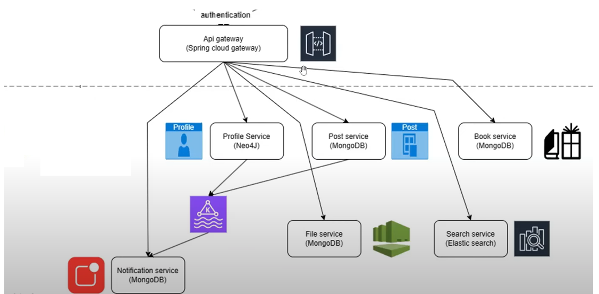
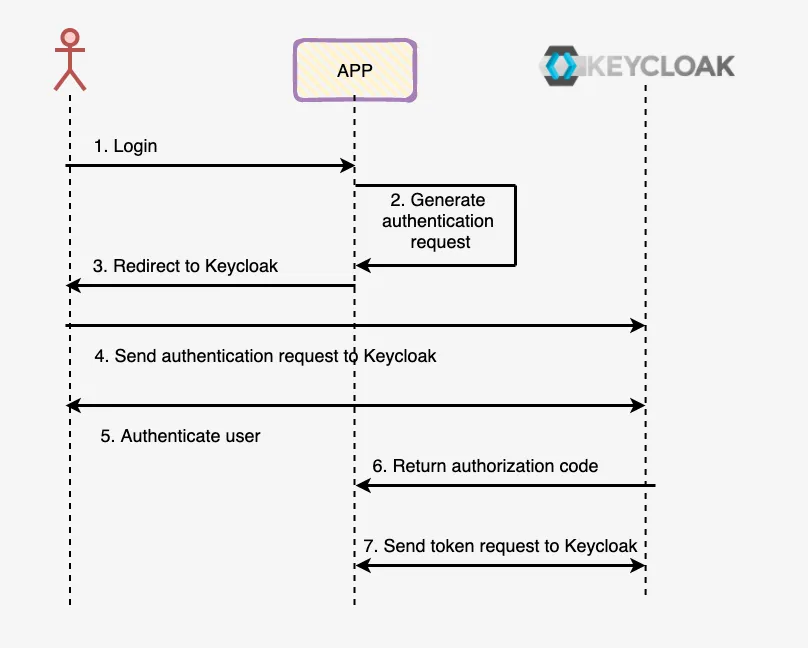

# Dự án Microservices Mạng xã hội đơn giản social_media

Đây là một dự án demo xây dựng theo kiến trúc microservices sử dụng Java Spring Boot, Docker và Keycloak.

## Mục Lục

- [Kiến trúc](#kiến-trúc)
- [Các Services](#các-services)
- [Công nghệ sử dụng](#công-nghệ-sử-dụng)
- [Cấu trúc Service (Ví dụ: profile-service)](#cấu-trúc-service-ví-dụ-profile-service)
- [Yêu cầu cài đặt](#yêu-cầu-cài-đặt)
- [Hướng dẫn cài đặt và chạy](#hướng-dẫn-cài-đặt-và-chạy)
- [Cấu hình Keycloak](#cấu-hình-keycloak)
- [Tài liệu tham khảo](#tài-liệu-tham-khảo)

## Kiến trúc

Dự án bao gồm các microservices độc lập, giao tiếp với nhau thông qua Spring cloud gateway, đóng vai trò là điểm vào (entry point) cho các request từ client, định tuyến chúng đến các service phù hợp. Keycloak được sử dụng để quản lý định danh và phân quyền (Authentication & Authorization). `docker-compose.yml` được dùng để quản lý và khởi chạy các service trong môi trường local bằng Docker.






## Các Services
* Service-to-service communication using Spring OpenFeign
* Each service has integrated Keycloak for authentication and authorization

Dưới đây là danh sách các service chính trong dự án:

1.  **`api-gateway`**:
    *   Chức năng: Là cổng vào chính cho tất cả các yêu cầu từ client. Chịu trách nhiệm routing, xác thực token (tích hợp với Keycloak).
    *   Công nghệ: Spring Cloud Gateway, Spring security
2.  **`profile-service`**:
    *   Chức năng: Quản lý thông tin hồ sơ người dùng (tạo, đọc, cập nhật, xóa - CRUD).
    *   Công nghệ: Spring Boot, Neo4j, Spring security, Kafka(gửi message đến notification-service khi tạo tài khoản), Keycloak
3.  **`post-service`**:
    *   Chức năng: Quản lý bài đăng (tạo, đọc, cập nhật, xóa - CRUD).
    *   Công nghệ: Spring Boot, MongoDb, Spring security, Keycloak
4.  **`notification-service`**:
    *   Chức năng: Xử lý và gửi thông báo (khi có người đăng kí account). lắng nghe sự kiện từ các service khác.
    *   Công nghệ: Spring Boot, MongoDb,Kafka, Spring security, Keycloak
5.  **`Keycloak`**: (Được quản lý qua Docker Compose)
    *   Chức năng: Identity and Access Management (IAM) server. Quản lý users, roles, realms, và cung cấp cơ chế xác thực/phân quyền (OAuth2/OpenID Connect).
6.  **`docker-compose.yml`**:
    *   Chức năng: Định nghĩa và quản lý các container cho tất cả các service, database, Keycloak, và các thành phần phụ thuộc khác để chạy trên môi trường local.

## Công nghệ sử dụng

*   **Ngôn ngữ:** Java 21
*   **Framework:** Spring Boot 3.4.4
*   **Build Tool:** Maven
*   **API Gateway:** Spring Cloud Gateway
*   **Authentication/Authorization:** Keycloak
*   **Containerization:** Docker, Docker Compose
*   **Database:** MongoDb, Neo4j, PostgreSQL, Redis
*   **Messaging/Events:** Kafka
*   **IDE Config:** `.idea` (IntelliJ IDEA)

## Cấu trúc Service (Ví dụ: `profile-service`)

Các service Spring Boot trong dự án thường tuân theo cấu trúc module Maven tiêu chuẩn:

## 🧩 Profile-Service

```
📁 profile-service  
├── 📁 .mvn                # Maven Wrapper cấu hình  
├── 📁 src  
│   ├── 📁 main  
│   │   ├── 📁 java  
│   │   │   └── 📁 com  
│   │   │       └── 📁 thang  
│   │   │           ├── 📁 event          # Gửi Kafka event (NotificationEvent.java)  
│   │   │           └── 📁 profile  
│   │   │               ├── 📁 configuration  # Cấu hình Beans, Security, ...  
│   │   │               ├── 📁 controller     # RestController xử lý HTTP request  
│   │   │               ├── 📁 dto            # DTO – truyền dữ liệu giữa lớp/API  
│   │   │               ├── 📁 entity         # Entity ánh xạ với DB  
│   │   │               ├── 📁 exception      # Xử lý ngoại lệ tùy chỉnh  
│   │   │               ├── 📁 mapper         # Dùng MapStruct chuyển DTO <-> Entity  
│   │   │               ├── 📁 repository     # Truy cập dữ liệu  
│   │   │               ├── 📁 service        # Business logic  
│   │   │               └── 📄 ProfileApplication.java  # Main class  
│   │   └── 📁 resources  
│   │       ├── 📄 application.yaml          # Cấu hình ứng dụng  
│   │       └── 📄 ...                        # Các tài nguyên khác  
│   └── 📁 test          # Unit/Integration test  
└── 📄 pom.xml           # Maven cấu hình dependencies/build plugins
```


## Yêu cầu cài đặt
Để chạy dự án này local, bạn cần cài đặt:

*   JDK (Phiên bản tương ứng với dự án, ví dụ: 21+)
*   Maven
*   Docker
*   Docker Compose

## Hướng dẫn cài đặt và chạy

1.  **Clone repository:**
    ```bash
    git clone [URL CỦA REPOSITORY]
    cd [TÊN THƯ MỤC REPOSITORY]
    ```

2.  **Build các service:**
    *(Cách build có thể khác nhau tùy thuộc bạn có parent `pom.xml` hay không)*
    *   **Cách 1: Build từng service (nếu không có parent pom)**
        ```bash
        cd api-gateway && mvn clean install && cd ..
        cd profile-service && mvn clean install && cd ..
        cd post-service && mvn clean install && cd ..
        cd notification-service && mvn clean install && cd ..
        ```
3.  **Chạy bằng Docker Compose:**
    *   Đảm bảo Docker Desktop (hoặc Docker Engine và Docker Compose) đang chạy.
    *   Đảm bảo bạn đã cấu hình Keycloak đúng cách (xem phần dưới).
    *   Từ thư mục gốc của dự án (chứa file `docker-compose.yml`):
        ```bash
        docker-compose up -d
        ```
        Lệnh này sẽ khởi tạo và chạy tất cả các service, database, Keycloak... được định nghĩa trong `docker-compose.yml` ở chế độ nền (`-d`).

4.  **Kiểm tra trạng thái:**
    ```bash
    docker-compose ps
    docker-compose logs -f [tên-service] # Để xem log của một service cụ thể
    ```

5.  **Dừng ứng dụng:**
    ```bash
    docker-compose stop
    ```

## Cấu hình Keycloak
*   Truy cập vào giao diện quản trị Keycloak `http://localhost:8180`.
*   tạo một `realm` social_media
*   Trong realm đó, tạo `client` tương ứng với các microservice cần bảo vệ (ví dụ: `post-service`, `profile-service`) và client cho frontend.
*   Tạo `users` và `roles` nếu cần.
*   Các service Spring Boot (`post-service`, `profile-service`, `api-gateway`) cần được cấu hình trong file `application.yml` để trỏ đến Keycloak server, đúng realm và client ID/secret. Ví dụ:
    ```properties
    spring:
      security:
        oauth2:
            resourceserver:
                jwt:
                    issuer-uri: http://localhost:8180/realms/social_media
    idp:
        url: http://localhost:8180
        client-id: social_app
        client-secret: It9ar58VqpWG7ITE1EKsxsmYZ9EASeoI
    ```
*   Xem chi tiết cấu hình Keycloak trong file `docker-compose.yml` của từng service.

---

## tài liệu tham khảo
* youtube: ```https://www.youtube.com/watch?v=fgfUby7qnWM&list=PL2xsxmVse9Ibud7tJn5dqJDUAVCg2Olyi&index=1```
* api keycloak: ```https://www.keycloak.org/docs-api/latest/rest-api/index.html```
* cloud gateway: ```https://docs.spring.io/spring-cloud-gateway/reference/spring-cloud-gateway/request-predicates-factories.html```
* spring security: ```https://docs.spring.io/spring-security/reference/servlet/oauth2/resource-server/jwt.html```